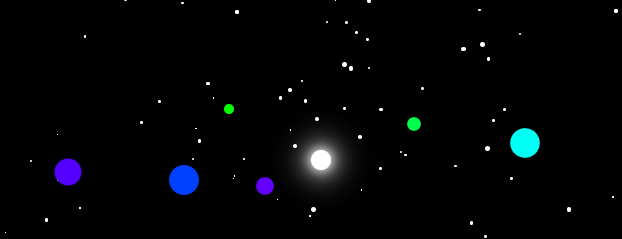
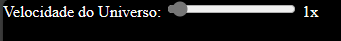
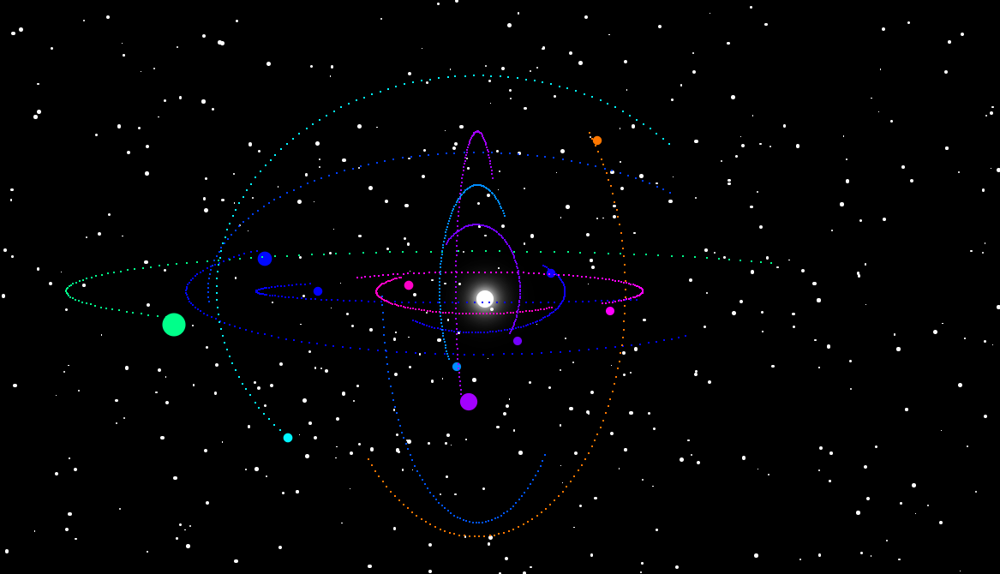
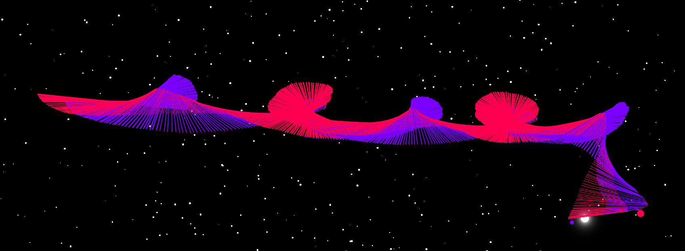
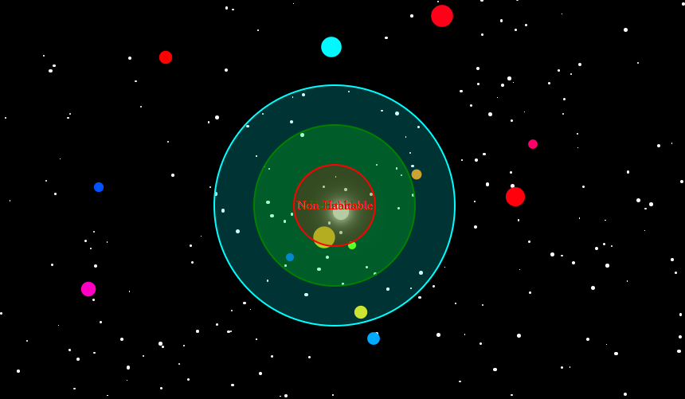

# Simulador de Sistema Estelar
## README gerado pela mesma IA usada nos projetos ([PHIND](https://phind.com)).

Bem-vindo ao Simulador de Sistema Estelar! Este projeto é uma aplicação web que permite criar e interagir com um sistema estelar dinâmico diretamente no seu navegador. Ele é construído usando HTML, CSS e JavaScript.
https://felpin007.github.io/Sistema-estelar/

## Visão Geral

O Simulador de Sistema Estelar permite que você crie um universo com um número especificado de planetas. Cada planeta orbita em torno do cursor do seu mouse, que atua como a estrela no centro do sistema. Você pode controlar a velocidade do universo e observar os planetas orbitando em tempo real.

## Recursos

- **Planetas Dinâmicos**: Cada planeta é criado com uma cor, tamanho e raio de órbita aleatórios. Eles se movem em tempo real, criando um sistema estelar dinâmico e visualmente atraente.
  
  
- **Controle de Velocidade**: Você pode controlar a velocidade do universo usando um controle deslizante. Isso permite acelerar ou desacelerar o movimento dos planetas.
  
  
- **Rastros dos Planetas**: Existem dois tipos de rastros disponíveis para os planetas. O primeiro tipo é um rastro individual que segue cada planeta. O segundo tipo cria uma conexão entre o planeta e o planeta mais próximo, criando uma rede de rastros.
  - Rastro Individual:
    
  - Rastro de Conexão:
    
- **Zonas**: Você pode alternar a visibilidade das zonas ao redor da estrela. Essas zonas são codificadas por cores e podem ser usadas para visualizar diferentes regiões do sistema estelar.
  

## Como Usar

1. Abra o arquivo `index.html` no seu navegador.
2. Você verá um formulário pedindo o número de planetas e a velocidade do universo. Insira os valores desejados e clique em "Criar Mundo".
3. Os planetas aparecerão e começarão a orbitar em torno do cursor do mouse.
4. Use o controle deslizante de velocidade no canto superior esquerdo da tela para controlar a velocidade do universo.
5. Pressione 'p' no seu teclado para alternar os rastros individuais dos planetas.
6. Pressione 'o' no seu teclado para alternar os rastros de conexão entre os planetas.
7. Pressione 'z' no seu teclado para alternar a visibilidade das zonas.

## Estrutura do Código

A lógica principal da aplicação está contida no arquivo `script.js`. Este arquivo lida com a criação de planetas, o movimento dos planetas e a interação com a interface do usuário. O arquivo `test.html` contém a estrutura HTML da aplicação, e os estilos CSS estão embutidos neste arquivo.
